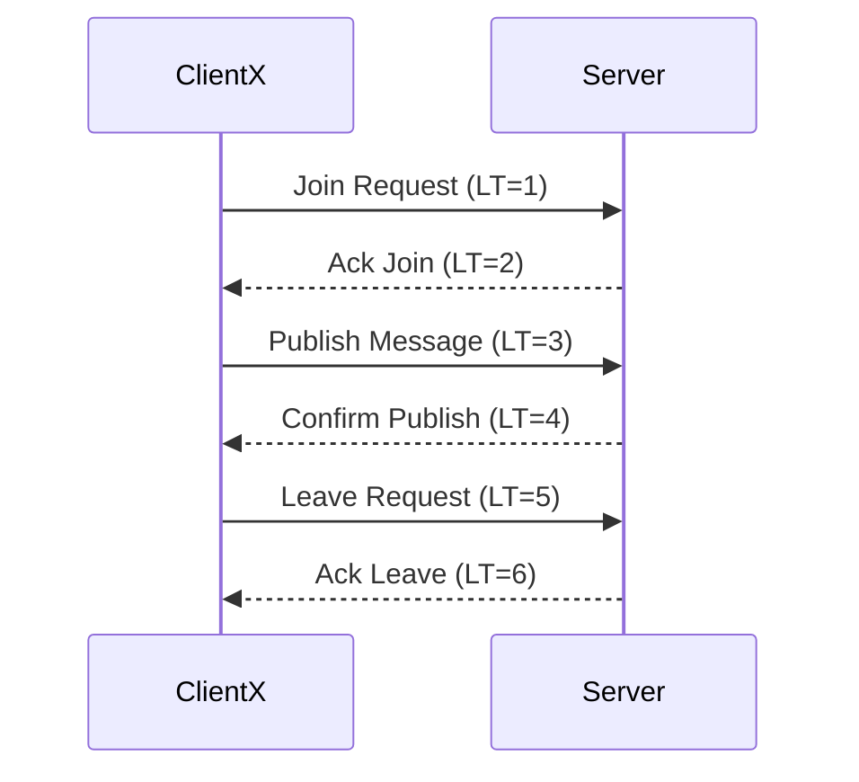

# Distributed System Design and Implementation Report

## 1. Streaming Model Selection
### 1.1 Discussion
- Discuss, whether you are going to use server-side streaming,
    client-side streaming, or bidirectional streaming?
-  

---

## 2. System Architecture
### 2.1 Overview
- **Architecture Type:**  
  _[Server-client, peer-to-peer, hybrid, etc.]_

### 2.2 Components
- **Server:** _[Brief description of responsibilities]_  
- **Client:** _[Brief description of responsibilities]_  

### 2.3 Communication Flow
- _[Describe how components interact — include message flow, data handling, and synchronization methods.]_

---

## 3. RPC Methods and Message Types
### 3.1 Implemented RPC Methods
| RPC Method | Type (Unary/Server Streaming/Client Streaming/Bidirectional) | Description |
|-------------|-------------------------------------------------------------|--------------|
| ExampleMethod | Unary | _[Description]_ |
| ... | ... | ... |

### 3.2 Message Types
| Message Name | Purpose | Fields |
|---------------|----------|--------|
| ExampleMessage | _[Description]_ | _[List of fields and data types]_ |
| ... | ... | ... |

---

## 4. Lamport Timestamp Implementation
### 4.1 Overview
_Describe how Lamport timestamps are calculated and updated across processes._

### 4.2 Algorithm Steps
1. _[Step 1: Initialize timestamp]_  
2. _[Step 2: Update on local event]_  
3. _[Step 3: Update on receiving a message]_  
4. _[Step 4: Synchronization rules]_  

### 4.3 Example
_Provide an example of timestamp evolution during message exchange._

---

## 5. Sequence Diagram
### 5.1 Interaction Flow
_Trace a sequence of RPC calls and Lamport timestamps corresponding to a specific scenario (e.g., Client X joins, publishes, leaves)._

### 5.2 Diagram

Generate proto files:
protoc -I=grpc --go_out=./grpc --go-grpc_out=./grpc grpc/chitchat.proto