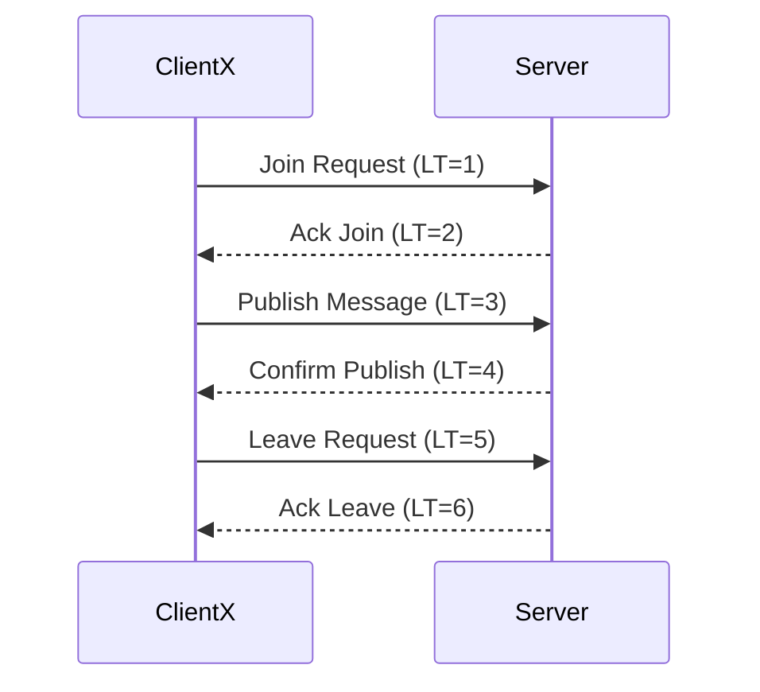

# Distributed System Design and Implementation Report

## 1. Streaming Model Selection

### 1.1 Discussion

- _Discuss, whether you are going to use server-side streaming,
    client-side streaming, or bidirectional streaming?_

- In our chit chat implementation we use server-side streaming ([1](https://grpc.io/docs/languages/go/basics/#server-side-streaming-rpc)), to send multiple messages from the server to the client. This is done to support long-lived logical flow of data from the server to the clients ([2](https://grpc.io/docs/guides/performance/))

---

## 2. System Architecture

### 2.1 Overview

- **Architecture Type:**  
  Chit chat is implemented as a server-client architecture, this allows for the server to serve multiple clients that can connect concurrently. Clients can leave and join whenever they like, and they will get the chat history send to them upon subscribing(connecting) to the server.
  
### 2.2 Components

- **Server:** The server is responsible for letting clients 'subscribe', publish messages to chit chat and unsubscribe when the client wants to leave. The server also keeps track of the message history. The server will announce when a new client either joins or leaves the server.

- **Client:** Clients can connect to the chit chat server using the 'subscribe' method, this is for the client to "register" at the server, and allows for the client to receive the message history and new messages that are being published by other clients. Registered clients can also publish new messages to the chit chat server, for other clients to receive.

### 2.3 Communication Flow

- _[Describe how components interact — include message flow, data handling, and synchronization methods.]_

---

## 3. RPC Methods and Message Types

### 3.1 Implemented RPC Methods

| RPC Method | Type (Unary/Server Streaming/Client Streaming/Bidirectional) | Description |
|-------------|-------------------------------------------------------------|--------------|
| ExampleMethod | Unary | _[Description]_ |
| ... | ... | ... |

### 3.2 Message Types

| Message Name | Purpose | Fields |
|---------------|----------|--------|
| ExampleMessage | _[Description]_ | _[List of fields and data types]_ |
| ... | ... | ... |

---

## 4. Lamport Timestamp Implementation

### 4.1 Overview

_Describe how Lamport timestamps are calculated and updated across processes._

### 4.2 Algorithm Steps

1. _[Step 1: Initialize timestamp]_  
2. _[Step 2: Update on local event]_  
3. _[Step 3: Update on receiving a message]_  
4. _[Step 4: Synchronization rules]_  

### 4.3 Example

_Provide an example of timestamp evolution during message exchange._

---

## 5. Sequence Diagram

### 5.1 Interaction Flow

_Trace a sequence of RPC calls and Lamport timestamps corresponding to a specific scenario (e.g., Client X joins, publishes, leaves)._

### 5.2 Diagram

Generate proto files:
protoc -I=grpc --go_out=./grpc --go-grpc_out=./grpc grpc/chitchat.proto